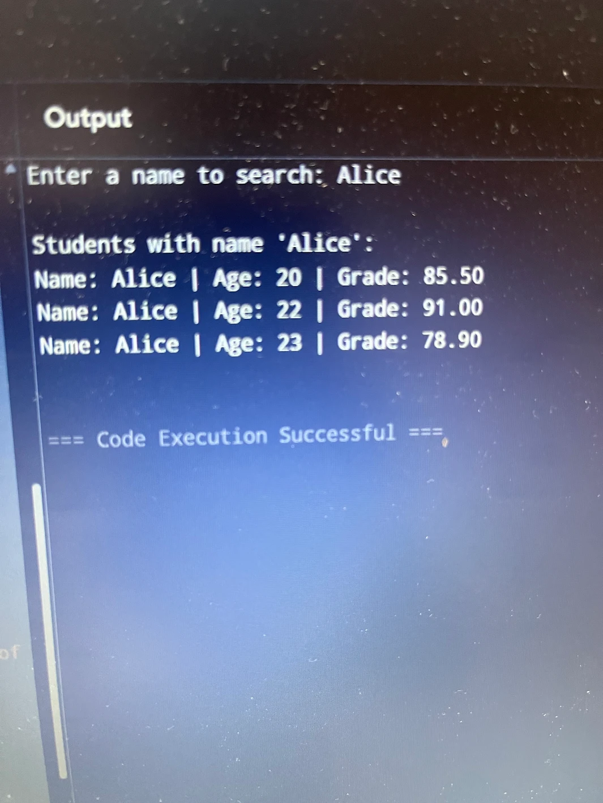

Create a C program that will:
1. Ask the user to enter a name to search
2. The program should compare the entered name with the names of all students using (strcmp)
3. If there are no matches, store all matching students in a dynamically allocated array.
4. Display the details (name, age, grade) of all matchin students.
5. If no student matches, display a message saying so

